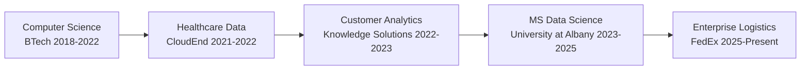

# Hi there, I'm Varshitha! 👋

##  Data Engineer | Cloud Architecture Enthusiast | ML Pipeline Builder

> *Turning complex data challenges into scalable business solutions across Fortune 500 companies*

I'm a passionate Data Engineer with 3 years of experience building enterprise-scale data infrastructure that processes millions of records daily. I love creating elegant solutions that don't just work—they work beautifully at scale.

---

###  What I'm Currently Working On

-  Building scalable ETL pipelines at **FedEx** processing 10M+ daily logistics transactions
-  Exploring advanced MLOps practices and real-time streaming architectures
-  Completing my MS in Data Science at University at Albany (May 2025)
-  Contributing to open-source data engineering tools

---

###  My Tech Stack

**Languages & Processing**
```
Python | SQL | PySpark | Apache Spark
```

**Cloud Platforms**
```
AWS ☁️        Azure ☁️       GCP ☁️
S3, Glue      Data Factory   BigQuery
Redshift      Synapse        Cloud Storage
Lambda        Blob Storage   Dataflow
```

**Data Engineering Tools**
```
 Apache Airflow     Databricks        Delta Lake
 Snowflake         Great Expectations  Unity Catalog
```

**DevOps & Visualization**
```
 Docker     Terraform     Power BI     Tableau
```

---

### 🏆 Highlights & Impact

```python
class DataEngineer:
    def __init__(self):
        self.experience = "3 years"
        self.pipelines_built = "Enterprise-scale ETL systems"
        self.daily_records_processed = "10M+"
        self.processing_time_reduced = "Up to 80%"
        self.business_value_created = "$50M+ revenue protection"
        
    def current_mission(self):
        return "Transforming FedEx logistics data into real-time insights"
```

---

### 🌟 Featured Projects

####  [Global Inflation Monitor](link-to-repo)
*Real-time economic intelligence platform*
- **Challenge**: 5-day manual reporting delays across 190+ countries
- **Solution**: Automated Spark + Snowflake pipeline processing 2M+ daily indicators
- **Impact**: 80% reduction in reporting time (5 days → 4 hours)
- **Tech**: `Python` `Apache Spark` `Snowflake` `Tableau` `AWS`

####  [Customer Churn Prediction Engine](link-to-repo)
*ML-powered retention intelligence system*
- **Challenge**: 25% annual churn with no early warning system
- **Solution**: End-to-end ML pipeline analyzing 500K+ customer patterns
- **Impact**: 87% prediction accuracy, $2.3M saved annually
- **Tech**: `Python` `scikit-learn` `Apache Airflow` `MLflow` `Databricks`


---

### 📊 GitHub Stats

<div align="center">
  


</div>

---

###  My Journey



---

###  Let's Connect!

-  **LinkedIn**: [Connect with me](your-linkedin-url)
-  **Email**: varshithag1908@gmail.com
-  **Phone**: (518) 528-7072
-  **Portfolio**: [View my work](link-to-portfolio-site)

---

### 🎯 Fun Facts

-  Built data pipelines spanning 190+ countries
-  Optimized systems processing 10M+ daily records
-  Worked with sensitive healthcare data (HIPAA-compliant)
-  Reduced processing times by up to 80% across multiple projects
-  Maintaining full academic scholarship while working full-time

---

**💡 "Data is the new oil, but without proper engineering, it's just crude. I build the refineries."**

---

⭐ **If my projects help you or inspire your work, consider giving them a star!**

---

<div align="center">
  


*Thanks for visiting my profile! Feel free to explore my repositories and reach out if you'd like to collaborate on exciting data engineering projects.*

</div>
